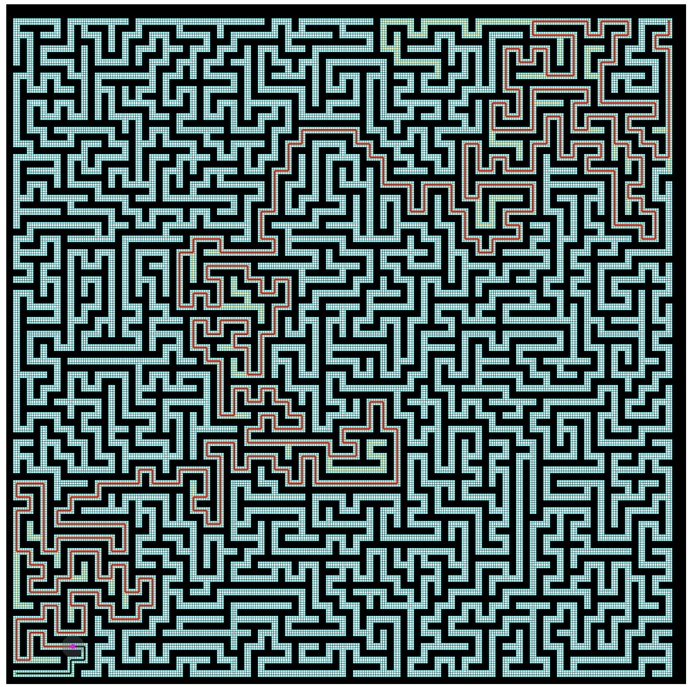
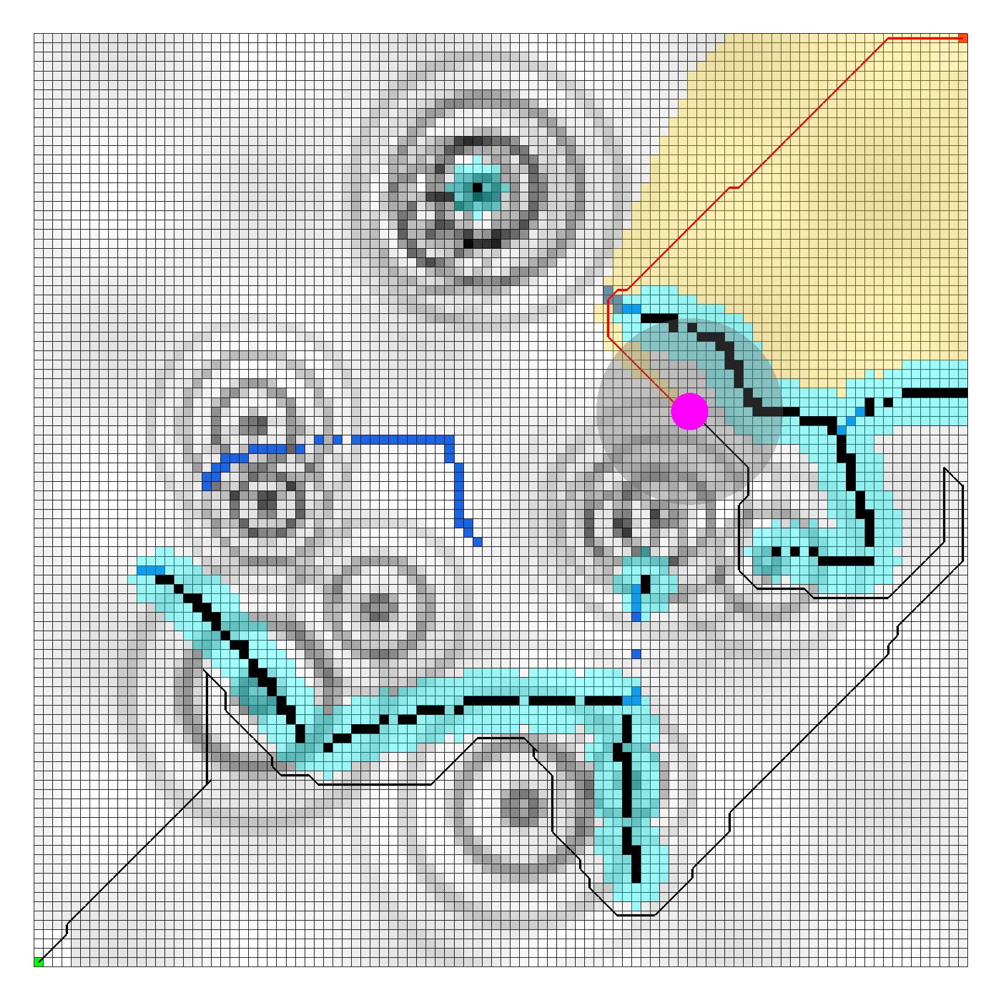

# Path Planning 🧭

This project implements a lightweight OpenGL-based viewer for grids maps with two built-in planners: **A\*** and **D\* Lite** for dynamic replanning. The planners operate with a circular agent model and handle obstacle avoidance through obstacle inflation, combined with a limited sensing range for detecting previously unknown obstacles. Furthermore, both planners incorporate grid cell traversability into their heuristic functions to improve path quality.

<div align="center" style="display: flex; gap: 1.5rem; justify-content: center; flex-wrap: wrap;">
	<figure style="margin: 0;">
		
		<figcaption style="margin-top: 0.5rem; font-size: 0.9rem;">A* planner navigating a maze.</figcaption>
	</figure>
	<figure style="margin: 0;">
		
		<figcaption style="margin-top: 0.5rem; font-size: 0.9rem;">D* Lite reacting to dynamic obstacles.</figcaption>
	</figure>
</div>


## ⚙️ Install

Ubuntu 24.04 example:

```bash
sudo apt update
sudo apt install build-essential make git python3 python3-glad \
		 libglfw3-dev libglm-dev libx11-dev libxrandr-dev libxinerama-dev \
		 libxcursor-dev libxi-dev libgl1-mesa-dev libglu1-mesa-dev mesa-utils
```

Clone and build:

```bash
git clone https://github.com/bestavra/Path-Planning.git
cd path_planning
make
make run
```

Executable: `build/bin/path_planning`

## 🕹️ Controls

- Scroll → Zoom in/out
  Shift + Scroll or Horizontal Scroll → Pan horizontally
- Ctrl  + Scroll → Pan vertically
- Left Click → Set start cell
- Right Click → Set goal cell
- Shift + Left Click + Drag → Add obstacles
- Ctrl + Left Click + Drag → Remove obstacles
- C → Remove all added obstacles
- ESC → Exit

**Note:** Explored cells appear highlighted (yellow) once planning runs. 
Inflated obstacles appear highlighted (cyan) and traversability of the map in grayscale
(black - not traversable).

## 📁 Layout

```
include/
	agent/	  # agent + interface
	map/      # map data structures + loader
	path/     # path planners, utils
	viewer/   # camera, renderers, input
src/
	agent/    # simple agent with sensing radius
	map/      # map logic
	path/     # A*, D* Lite implementations
	viewer/   # OpenGL implementations
data/         # sample .map files
```

## 🧱 Map Format

```
# comments optional
<width> <height> <resolution>
<row 0 values>
...
```

Cell values in $[0.0,1.0]$ (free → blocked), `-1` marks unknown cells.

## 🛠️ Makefile Targets & Options

```bash
make            # build release binary
make run        # build + launch viewer
make clean      # remove build artifacts
make BUILD_TYPE=Debug   # switch configuration
make CXX=g++            # choose compiler
```

Additional targets are listed with `make help`.

## 📄 License

This project is licensed under the [MIT License](LICENSE).

Bundled third-party components:

- `third_party/glad` — GLAD OpenGL loader, © 2013-2023 David Herberth, licensed under MIT (license text included in
	`LICENSE`).
